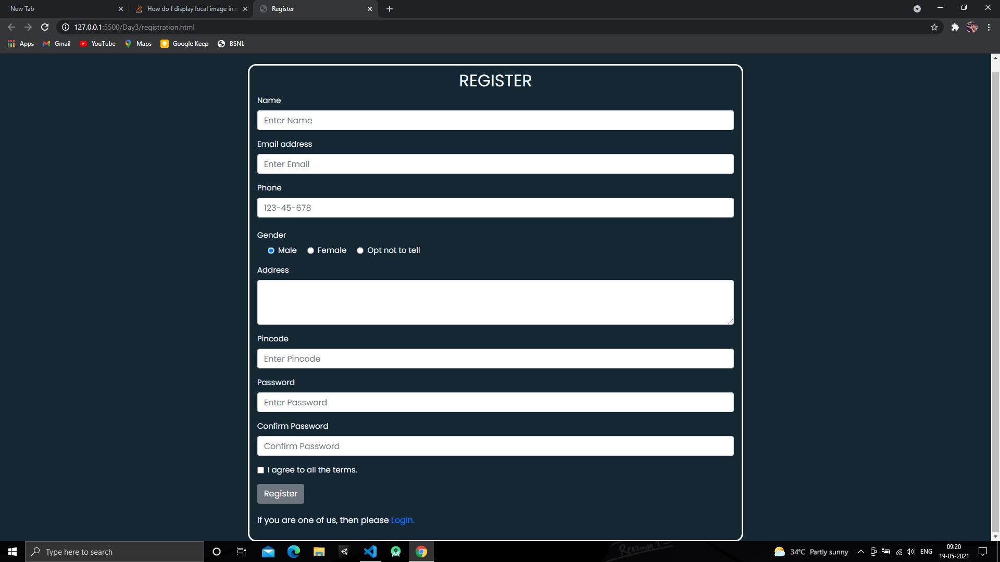

## Full Stack MEAN Course Provided by [Syllogistek](https://www.syllogistek.com/ "Syllogistek")

### Day 1 (15/05/2021) :

- Learnt about Domain Name Server(DNS), World Wide Web(www), IP adress, How a server works?, What is a Server?
- Basics of MEAN Stack, What does MEAN stands for?, What technologies are used in that stack?
- What is an URL?, How does it work?
- Learnt about basic HTML tags like h1,h2,h3 also about lists ol(ordered lists) ul(unordered lists)
- Completed the Assignment which was to built a webpage for your own profile

### Day 2 (17/05/2021) :

- Learnt about description tags in HTML like dt, dl, dd and also tags like strong, em, u, del, a (anchor tag)
- Table tags like td, tr, th also about the table attr. colspan, rowspan, border
- CSS inline, internal, external styling, fonts, colors, CSS class and id selectors
- HTML forms, input, label, radiobuttons, checkboxes, select, options, textarea
- &nbsp for giving space in the input tag
- Completed the assignment which was to create 2 webpages i.e. registration and login

### Day 3 (18/05/2021) :

- More about CSS external styling, external fonts from website like Google Fonts, favicons
- HTML div properties like float, clear
- CSS Media Queries
- CSS Framework Bootstrap introduction, container, breakpoints, row, col
- Bootstrap Components like Forms, Navbar
- Completed the assignment which was to make registration and login form using Bootstrap Framework.

### Day 4 (19/05/2021) :

- Javascript Basics , console.log(), alert(), ES6 Scripts
- Difference between var, let, const
- typeof keyword, scope, prompt
- Conditional Functions, NaN, Number
- Completed the assignment which was to write simple programs in Javascript

### Day 5 (20/05/2021) :

- Functions, Anonymous Function, Arrow Function
- setTimeout(), Async Programming, Arrays
- push(), pop(), shift(), unshift(), splice(), forEach(), filter(), map() functions with examples
- Objects, Object Literal, object destructuring,, this keyword
- Completed the assignment which was to write a program for perfect no. using arrow function
